# 🏓 ft_transcendence - Modern Pong Evolution 🚀

A next-generation Pong experience with tournaments, AI opponents, and advanced web features, created as part of 42 School's curriculum.

## ✅ Implemented Features Checklist

### 🎮 **Game Core**
- [x] Real-time PvP matches (shared keyboard)
- [x] Tournament system with player rotation tracking
- [x] Unified game rules & paddle speeds
- [x] 1972 Pong-style essence preservation
- [x] 3D Visualization with Three.js/WebGL 🕶️

### 🌐 **Web Infrastructure**
- 🚀 Django backend framework
- 🔧 Bootstrap frontend toolkit
- 🗄️ PostgreSQL database integration
- 🧩 Microservices architecture
- 🔒 JWT Authentication system
- 📊 ELK Stack (Elasticsearch, Logstash, Kibana)
- 📈 Prometheus/Grafana monitoring

### 👤 **User Management**
- [x] Secure registration/login system
- [x] Customizable profiles with avatars
- [x] Friends system with online status
- [x] Match history tracking
- 🚀 2FA Authentication (Authenticator)

### 🤖 **AI**
- 🚀 Adaptive AI opponent with human-like behavior


## 🛠️ Services Documentation
<!---
### Game Services
| Service          | Technology     | Description                                  |
|-------------------|----------------|----------------------------------------------|
| Tournament Engine| Django         | Manages tournament logic & player rotation   |
| 3D Renderer      | Three.js       | Handles 3D court & paddle visualization      |
| Physics Engine   | Javascript        | Ball movement & collision detection system   |

### Web Services
| Service          | Technology     | Description                                  |
|-------------------|----------------|----------------------------------------------|
| Auth Service      | JWT/Django     | Handles 2FA, login, and session management   |
| User Service      |  Django        | Manages profiles, friends                    |
| Match History     | PostgreSQL     | Stores game results and player performance   |
--->

<p align="center"> 
 
 

 
 
 
 

 
 
</p>

### Infrastructure

```mermaid
%%{init: {'theme': 'dark', 'themeVariables': { 
  'primaryColor': '#1a1a1a',
  'clusterBkg': '#2a2a2a',
  'edgeLabelBackground':'#333',
  'tertiaryColor': '#1a1a1a'
}}}%%
graph TD
    Client("🌐 Client (HTTPS/443)") --> Proxy["🛡️ Nginx Proxy (443/SSL)
    ▪️ Routes: /api/*, /media
    ▪️ Rate limiting
    ▪️ JWT validation"]

    subgraph "📦 Frontend"
        Proxy --> Static["📄 Static Files
        (JS/HTML/CSS @ /var/www/html)"]
    end

    subgraph "⚙️ Backend Services"
        Proxy -->|"/api/auth/* HTTP/1.1 8001
               /api/user/* HTTP/1.1 8001 "| Auth[("🔑 Auth Service
        🐍 Django @ :8001
        ▪️ 2FA/JWT
        ▪️ User management")]
        Proxy -->|"/api/tournament HTTP/1.1 8003"| Tournament[("🏆 Tournament Service
        🐍 Django @ :8003
        ▪️ Matchmaking
        ▪️ Game logic")]
        Proxy -->|"/api/history/* HTTP/1.1 8002"| History[("📜 History Service
        🐍 Django @ :8002
        ▪️ Match records
        ▪️ Statistics")]
        
        Auth -->|"auth_db:5432 Connection pool"| AuthDB[("💾 Auth DB
        🐘 PostgreSQL @ :5432")]
        Tournament -->|"tournament_db:5432"| TournDB[("💾 Tournament DB
        🐘 PostgreSQL @ :5432")]
        History -->|"history_db:5432"| HistDB[("💾 History DB
        🐘 PostgreSQL @ :5432")]
    end

    subgraph "📊 Monitoring"
        Proxy -->|"/grafana/ HTTP/1.1 3000"| Grafana[("📈 Grafana
        @ :3000
        ▪️ Dashboards")]
        Proxy -->|"/prometheus/ HTTP/1.1 9090"| Prometheus[("📡 Prometheus
        @ :9090
        ▪️ Metrics storage")]
        Prometheus -->|"Scrape HTTP/1.1"| NodeExporter[("🖥️ Node Exporter
        @ :9100
        ▪️ Host metrics")]
        Prometheus -->|"Scrape HTTP/1.1"| NginxExporter[("🔌 NGINX Exporter
        @ :9113
        ▪️ Proxy metrics")]
        Grafana -->|"grafana_db:5432"| GrafanaDB[("💾 Grafana DB
        🐘 PostgreSQL @ :5432")]
        
        Prometheus -. "Healthcheck HTTP/2xx" .-> NodeExporter
        Prometheus -. "Healthcheck HTTP/2xx" .-> NginxExporter
    end

    subgraph "📚 ELK Stack"
        Proxy -->|" /kibana/ 5601"| Kibana[("🔍 Kibana
        @ :5601
        ▪️ Log visualization")]
        Kibana -->|"REST HTTPS 9200"| Elasticsearch[("📚 Elasticsearch Cluster
        ▪️ es01:9200
        ▪️ es02:9200
        ▪️ es03:9200")]
        Logstash[("⚙️ Logstash
        @ :5044
        ▪️ Log processing")] --> Elasticsearch
        Filebeat[("📁 Filebeat
        ▪️ Log shipping")] --> Logstash
        Filebeat -.-> NginxLogs["📄 Nginx Logs
        /var/log/nginx/*"]
    end

    %% Healthcheck Relationships
    Kibana -. "HTTPS 200 /api/status" .-> Elasticsearch

    classDef proxy fill:#c62828,stroke:#fff;
    classDef frontend fill:#2e7d32,stroke:#fff;
    classDef service fill:#1b5e20,stroke:#fff;
    classDef db fill:#0d47a1,stroke:#fff;
    classDef monitor fill:#4a148c,stroke:#fff;
    classDef elk fill:#006064,stroke:#fff;
    classDef utility fill:#37474f,stroke:#fff;
    classDef client fill:#4e342e,stroke:#fff;
    
    class Client client;
    class Proxy proxy;
    class Static frontend;
    class Auth,Tournament,History,Logstash,Filebeat service;
    class AuthDB,TournDB,HistDB,GrafanaDB db;
    class Grafana,Prometheus,NodeExporter,NginxExporter monitor;
    class Kibana,Elasticsearch elk;
    class Adminer utility;
```

### 🚦 Monitoring Stack
Monitoring Architecture

### 🚀 Getting Started

#### Prerequisites

- 🐋 Docker

#### Installation
```bash
Copy
git clone https://github.com/OsemaFadhel/Transcendence.git
cd Transcendence
make
```

<!---📸 Screenshots
Feature	Preview
3D Gameplay	Gameplay
Tournament Lobby	Lobby
User Profile	Profile
--->


### 🛡️ Security Features
🔒 Two-Factor Authentication

🔑 JWT Token Validation

🔄 Session Encryption

🚨 Rate Limiting

🔍 Input Sanitization

🌟 Contributors </br>
[Osema F 🔐](https://github.com/OsemaFadhel) | [almat101 🕵🏻](https://github.com/almat101) | [NicoTerabyte 👾](https://github.com/NicoTerabyte)
