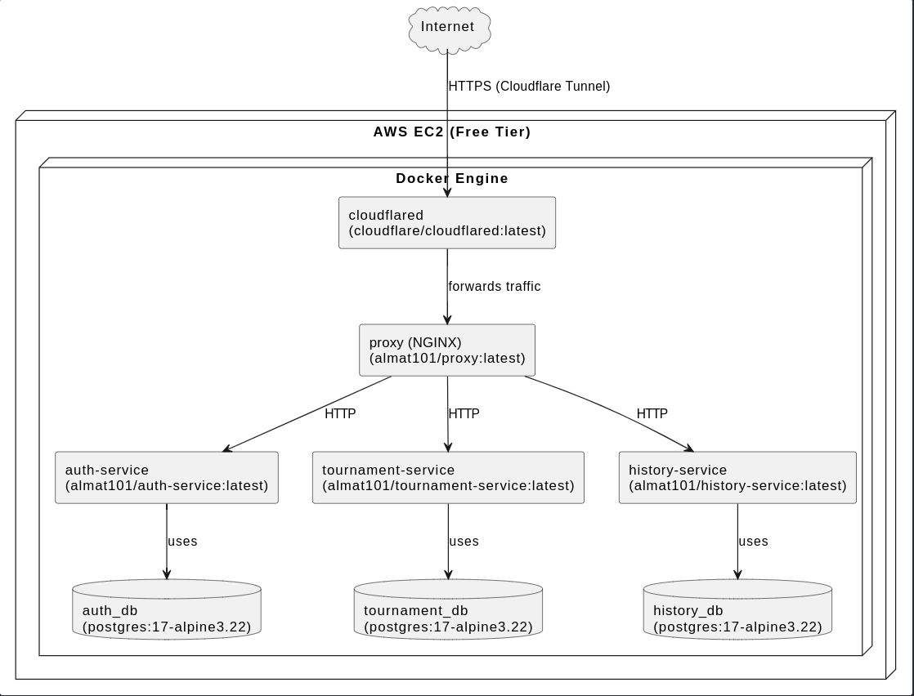

# 🏓 mini_transcendence - Modern Pong Evolution 🚀 Enhanced with Ansible for Seamless Automation

### All microservices are optimized by using Alpine-based images to run on an AWS Free Tier EC2 (hosting the Pong SPA site at [link](https://transcendence.alematta.com/)). Extensive DevOps components like Grafana, Prometheus, and ELK were removed due to AWS Free Tier limitations.

## 📚 Documentation

- 🚀 [Ansible Deployment Guide](ansible.md) - Complete automation setup and deployment instructions

A next-generation Pong experience with tournaments, AI opponents, and advanced web features, created as part of 42 School's curriculum.

---

## 🗺️ Architecture Overview

Below is a high-level architecture diagram of the mini_transcendence platform, showing how traffic flows from the Internet through Cloudflare Tunnel (enabling HTTPS) to the EC2 instance, where the Dockerized microservices and databases run behind an NGINX reverse proxy.

---

## ⚙️ CI/CD Pipeline

The project uses a modern CI/CD pipeline managed via [GitHub Actions](.github/workflows/deploy.yml):

### 🛠️ Continuous Integration (CI)
- **Trigger:** On every push to the `main` branch
- **Steps:**
  - Checkout code
  - Set up dummy environments
  - Build all Docker images
  - Run integration test 
  - Clean up containers
  - Login to Docker Hub
  - Build and push images to Docker Hub with appropriate tags

### 🚀 Continuous Deployment (CD)
- **Trigger:** After successful CI completion
- **Steps:**
  - Checkout code
  - Set up Python, create virtual environment, and install Ansible
  - Write Ansible vault password to a file from GitHub secrets
  - Configure AWS credentials (AWS CLI)
  - Get the current public IP of the runner
  - Open SSH port on the target EC2 instance only for the runner's IP (for secure deploy)
  - Write EC2 SSH key to a file for the runner
  - Run Ansible playbooks to deploy the latest Docker images to the AWS VPS
  - Close the SSH port after deployment for security

You can find the workflow definition in [`.github/workflows/deploy.yml`](.github/workflows/deploy.yml).

---

## ✅ Implemented Features Checklist

### 🎮 **Game Core**
- [x] Real-time PvP matches (shared keyboard)
- [x] Tournament system with player rotation tracking
- [x] Unified game rules & paddle speeds
- [x] 1972 Pong-style essence preservation
- [x] 3D Visualization with Three.js/WebGL 🕶️

### 🌐 **Web Infrastructure**
- 🚀 Django backend framework
- 🔧 Bootstrap frontend toolkit
- 🗄️ PostgreSQL database integration
- 🧩 Microservices architecture
- 🔒 JWT Authentication system

### 👤 **User Management**
- [x] Secure registration/login system
- [x] Customizable profiles with avatars
- [x] Friends system with online status
- [x] Match history tracking
- 🚀 2FA Authentication (Authenticator)

### 🤖 **AI**
- 🚀 Adaptive AI opponent with human-like behavior

### 🛡️ Security Features
🔒 Two-Factor Authentication

🔑 JWT Token Validation

🔄 Session Encryption

🚨 Rate Limiting

🔍 Input Sanitization

🌟 Contributors  
[Osema F 🔐](https://github.com/OsemaFadhel) | [almat101 🕵🏻](https://github.com/almat101) | [NicoTerabyte 👾](https://github.com/NicoTerabyte)
