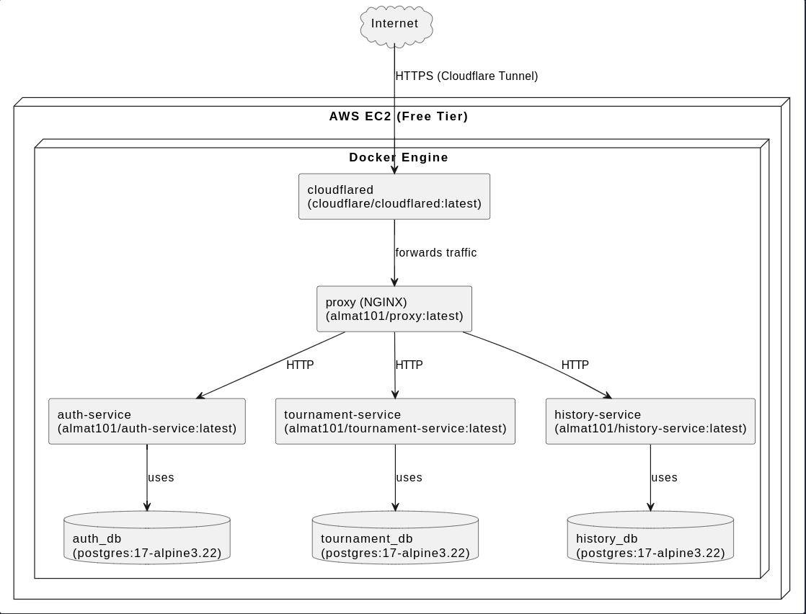

# 🏓 mini_transcendence - Modern Pong Evolution 🚀 Enhanced with Ansible for Seamless Automation

### All microservices are optimized using Alpine-based images, deployed on a Hetzner VPS (4GB RAM) hosting the Pong SPA site at [transcendence.alematta.com](https://transcendence.alematta.com/).

## 📚 Documentation

- 🚀 [Ansible Deployment Guide](ansible.md) - Complete automation setup and deployment instructions

A next-generation Pong experience with tournaments, AI opponents, and advanced web features, created as part of 42 School's curriculum.

---

## 🗺️ Architecture Overview

Below is a high-level architecture diagram of the mini_transcendence platform, showing how traffic flows from the Internet through Cloudflare Tunnel (enabling HTTPS) to the VPS, where the Dockerized microservices and databases run behind an NGINX reverse proxy.

---

## 📊 Monitoring Stack

The platform includes a comprehensive monitoring solution:

### Grafana
- **Dashboard visualization** for all services and infrastructure metrics
- Accessible at `/grafana/` endpoint
- Pre-configured dashboards for Django services and node-exporter full. 

### Prometheus
- **Metrics collection** from all microservices
- Scrapes metrics from:
  - `auth-service`, `history-service`, `tournament-service` (Django Prometheus)
  - `node-exporter` (system metrics)
  - `postgres-exporter` (database metrics for all 3 PostgreSQL instances)
  - `nginx-prometheus-exporter` (reverse proxy metrics)
- 10-day data retention policy

### Alertmanager
- **Email notifications** for critical alerts
- Configured alert rules:

| Alert | Severity | Description |
|-------|----------|-------------|
| `InstanceDown` | 🔴 Critical | Any service instance down for >1 min |
| `PostgreSQLDown` | 🔴 Critical | PostgreSQL instance unreachable |
| `HighPostgresConnections` | 🟡 Warning | More than 100 active DB connections |
| `SlowQueries` | 🟡 Warning | Queries running slower than 5s average |
| `ReplicationLag` | 🔴 Critical | Replication delay exceeds 100 seconds |
| `LowDiskSpace` | 🔴 Critical | Database using more than 90GB disk |
| `HostHighCpuLoad` | 🟡 Warning | CPU load >80% for 5 minutes |
| `HostOutOfDiskSpace` | 🟡 Warning | Disk almost full (<10% left) |
| `HostOutOfMemory` | 🟡 Warning | RAM filling up (<10% left) |
| `NginxProxyDown` | 🔴 Critical | NGINX proxy down for >1 min |

---

## ⚙️ CI/CD Pipeline

The project uses a modern CI/CD pipeline managed via [GitHub Actions](.github/workflows/deploy.yml):

### Continuous Integration (CI)
- **Trigger:** On every push to the `main` branch
- **Steps:**
  - Checkout code
  - Generate dummy `.env` file for CI environment
  - Build all Docker images.
  - Run integration tests ( only backend auth-service)
  - Clean up containers.
  - Login to **GitHub Container Registry (GHCR)** using `GITHUB_TOKEN`
  - Build and push Docker images to `ghcr.io` with commit SHA tags:
    - `ghcr.io/almat101/proxy:<sha>`
    - `ghcr.io/almat101/auth-service:<sha>`
    - `ghcr.io/almat101/tournament-service:<sha>`
    - `ghcr.io/almat101/history-service:<sha>`

### Continuous Deployment (CD)
- **Trigger:** After successful CI completion
- **Steps:**
  - Checkout code
  - Set up Python 3.12, create virtual environment, and install Ansible
  - Install `community.docker` Ansible Galaxy collection
  - Export Hetzner VPS IP from GitHub secrets
  - Write Ansible vault password to a file from GitHub secrets
  - Write SSH key for the runner to connect to the VPS
  - Run Ansible deploy playbook to pull and deploy the latest Docker images to the Hetzner VPS

### Cleanup Job (Retention Policy)
- **Trigger:** After successful CI completion
- **Purpose:** Automatically manages container image retention in GitHub Container Registry
- **Steps:**
  - Cleans up old versions of each container image (`proxy`, `auth-service`, `tournament-service`, `history-service`)
  - **Keeps the 5 most recent versions** of each image
  - Deletes both tagged and untagged versions to save storage
  - Uses a Personal Access Token (PAT) for package management permissions

You can find the workflow definition in [`.github/workflows/deploy.yml`](.github/workflows/deploy.yml).

---

## ✅ Implemented Features Checklist

### 🎮 **Game Core**
- [x] Real-time PvP matches (shared keyboard)
- [x] Tournament system with player rotation tracking
- [x] Unified game rules & paddle speeds
- [x] 1972 Pong-style essence preservation
- [x] 3D Visualization with Three.js/WebGL 🕶️

### 🌐 **Web Infrastructure**
- 🚀 Django backend framework
- 🔧 Bootstrap frontend toolkit
- 🗄️ PostgreSQL database integration
- 🧩 Microservices architecture
- 🔒 JWT Authentication system

### 👤 **User Management**
- [x] Secure registration/login system
- [x] Customizable profiles with avatars
- [x] Friends system with online status
- [x] Match history tracking
- 🚀 2FA Authentication (Authenticator)

### 🤖 **AI**
- 🚀 Adaptive AI opponent with human-like behavior

### 📈 **Monitoring & Observability**
- [x] Grafana dashboards for real-time visualization
- [x] Prometheus metrics collection from all services
- [x] Alertmanager email notifications
- [x] PostgreSQL exporters for database monitoring
- [x] NGINX metrics via nginx-prometheus-exporter
- [x] Node exporter for system-level metrics

### 🛡️ Security Features
🔒 Two-Factor Authentication

🔑 JWT Token Validation

🔄 Session Encryption

🚨 Rate Limiting

🔍 Input Sanitization

# =============================
# Local Development: Migrations
# =============================

**IMPORTANT:** Before running the app locally, you MUST apply database migrations!

**How to do it:**

Run:

  make migrate-dev-run-all

This will:
- Create new migration files for any model changes
- Apply all migrations to your local development databases

**Why is this important?**
- If you do NOT run migrations, your Django apps will fail to start or respond with HTTP 500 errors ("Internal Server Error") because the database schema will not match your models.
- Always run migrations after pulling new code, switching branches, or changing models.

**Typical workflow:**
1. `make dev-up`
2. `make migrate-dev-run-all`
3. Access your app at [http://localhost:8080](http://localhost:8090)

If you see 500 errors on API endpoints, check your logs and make sure migrations have been applied!

🌟 Contributors  
[Osema F 🔐](https://github.com/OsemaFadhel) | [almat101 🕵🏻](https://github.com/almat101) | [NicoTerabyte 👾](https://github.com/NicoTerabyte)
